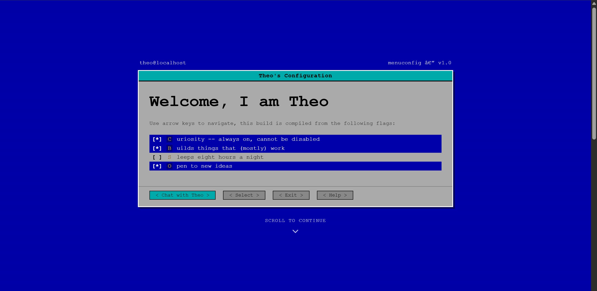

# learnfromfail-website
Retro terminal-inspired personal website and contact page built as an HTML/CSS learning project.
# LearnFromFail — Personal Portfolio Website

**Live website:** https://learnfromfail.tiiny.site

LearnFromFail is my personal portfolio and contact website built while learning **HTML and CSS**. The design is inspired by a Linux terminal and retro system-configuration interfaces.

## Preview

### Chat interface

### Welcome screen

### Contact section

## About

This project was created to practice:

- HTML structure
- CSS styling
- responsive design
- publishing a live website

## Technologies

- HTML5
- CSS3
- JavaScript

## Author

**Theo**

- Website: https://learnfromfail.tiiny.site
- GitHub: https://github.com/learnfromfail210
